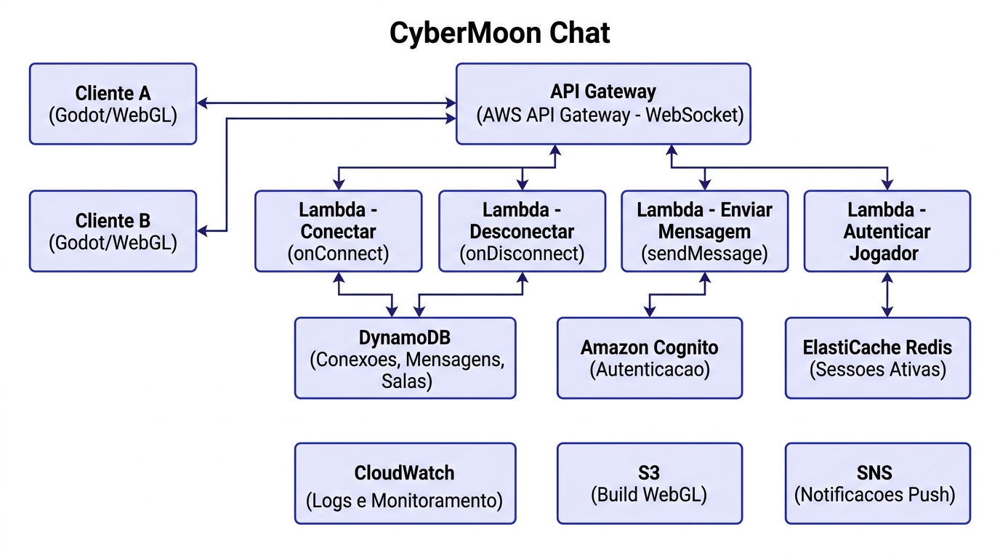
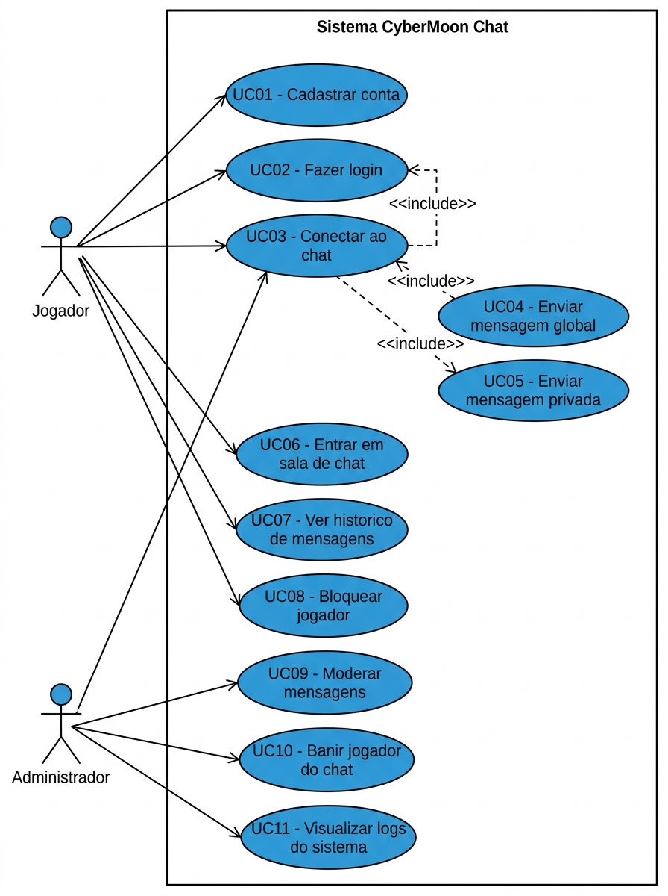
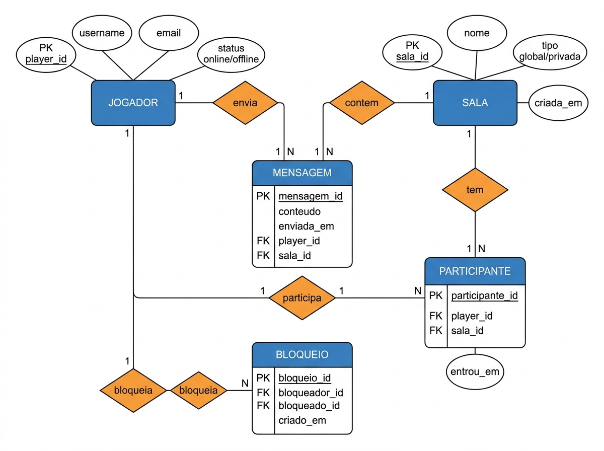
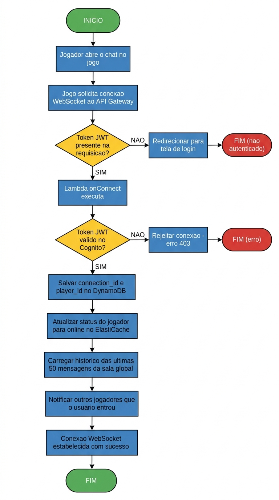
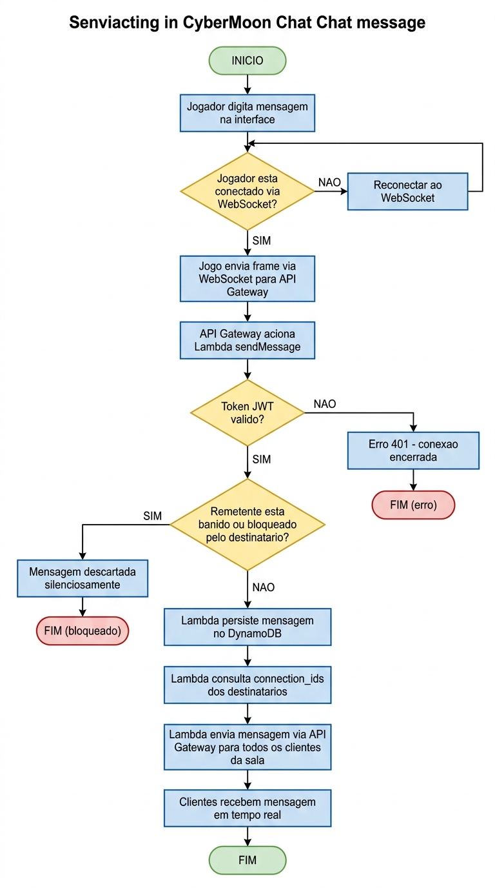

# CyberMoon Chat - Documentacao do Sistema de Nuvem

**Disciplina:** Infraestrutura e Servicos de Nuvem  
**Projeto:** CyberMoon - Sistema de Chat entre Jogadores  
**Equipe:** Antonio Marcos da Silva, Bernardo Silva Bombazaro  

---

## Visao Geral do Projeto

O **CyberMoon Chat** e um sistema de comunicacao em tempo real integrado ao jogo CyberMoon - um RPG de fazenda com tematica cyberpunk desenvolvido em Godot. O objetivo e utilizar servicos de nuvem da **AWS (Amazon Web Services)** para permitir que jogadores se comuniquem em tempo real atraves de um chat global, salas tematicas e mensagens privadas, usando conexoes **WebSocket** persistentes gerenciadas pelo API Gateway.

---

## 1. Requisitos Funcionais

| ID | Requisito |
|----|-----------|
| RF01 | O sistema deve permitir que o jogador se cadastre com e-mail e senha. |
| RF02 | O sistema deve autenticar o jogador via e-mail e senha antes de acessar o chat. |
| RF03 | O sistema deve estabelecer uma conexao WebSocket persistente entre o cliente e o servidor ao abrir o chat. |
| RF04 | O sistema deve permitir que o jogador envie mensagens para o chat global, visivel a todos os jogadores conectados. |
| RF05 | O sistema deve permitir que o jogador envie mensagens privadas para outro jogador especifico. |
| RF06 | O sistema deve permitir que o jogador entre e saia de salas de chat tematicas (ex: "Fazendeiros", "Combatentes"). |
| RF07 | O sistema deve exibir o historico das ultimas 50 mensagens ao entrar em uma sala ou no chat global. |
| RF08 | O sistema deve permitir que o jogador bloqueie outro jogador, impedindo de receber suas mensagens. |
| RF09 | O sistema deve exibir o status de presenca dos jogadores (online/offline) em tempo real. |
| RF10 | O sistema deve permitir que administradores modifiquem ou removam mensagens inadequadas. |
| RF11 | O sistema deve permitir que administradores baniam jogadores do chat. |
| RF12 | O sistema deve registrar logs de todas as conexoes, desconexoes e mensagens enviadas. |

---

## 2. Requisitos Nao Funcionais

| ID | Requisito | Categoria |
|----|-----------|-----------|
| RNF01 | Mensagens devem ser entregues em no maximo **300ms** para todos os clientes conectados. | Desempenho |
| RNF02 | O sistema deve suportar **ate 1.000 conexoes WebSocket simultaneas** sem degradacao. | Escalabilidade |
| RNF03 | A disponibilidade do sistema deve ser de **99,5% (SLA)**. | Disponibilidade |
| RNF04 | Autenticacao deve ser feita via **Amazon Cognito** com tokens JWT validados em cada conexao. | Seguranca |
| RNF05 | Dados de mensagens e usuarios devem ser armazenados em conformidade com a **LGPD**. | Privacidade |
| RNF06 | O sistema deve ser **serverless** utilizando API Gateway WebSocket e Lambda. | Infraestrutura |
| RNF07 | O custo de infraestrutura deve ficar dentro do **Free Tier ou camada basica da AWS**. | Custo |
| RNF08 | O status de presenca dos jogadores deve ser atualizado em no maximo **5 segundos**. | Desempenho |
| RNF09 | Mensagens com conteudo ofensivo devem ser filtradas antes da entrega (lista de palavras bloqueadas). | Moderacao |
| RNF10 | Toda comunicacao deve ocorrer sobre **WSS (WebSocket Seguro / TLS 1.2+)**. | Seguranca |

---

## 3. Regras de Negocio

| ID | Regra |
|----|-------|
| RN01 | Apenas jogadores autenticados podem conectar ao chat e enviar mensagens. |
| RN02 | Mensagens devem ter no maximo **300 caracteres**. |
| RN03 | Um jogador banido do chat nao pode estabelecer nova conexao WebSocket ate o fim do banimento. |
| RN04 | Mensagens de jogadores bloqueados sao descartadas silenciosamente - o remetente nao e notificado. |
| RN05 | O historico de mensagens e mantido por **30 dias**, apos isso e deletado automaticamente. |
| RN06 | Um jogador nao pode enviar mais de **10 mensagens por minuto** (anti-spam). |
| RN07 | Salas privadas so podem ser criadas por jogadores com nivel de fazenda maior ou igual a 5. |
| RN08 | Mensagens privadas so chegam ao destinatario se ele **nao bloqueou** o remetente. |
| RN09 | O status "online" e removido automaticamente apos **30 segundos** sem atividade no WebSocket. |
| RN10 | Administradores podem remover qualquer mensagem, mas ela permanece no log interno do CloudWatch. |

---

## 4. Casos de Uso

### UC01 - Cadastrar Conta

| Campo | Descricao |
|-------|-----------|
| **Ator** | Jogador |
| **Pre-condicao** | O jogador nao possui conta no sistema. |
| **Fluxo Principal** | 1. Jogador acessa a tela de cadastro. 2. Informa username, e-mail e senha. 3. Sistema valida unicidade. 4. Cognito cria a conta. 5. Lambda cria perfil no DynamoDB. 6. Sistema exibe mensagem de sucesso. |
| **Fluxo Alternativo** | 3a. Username ou e-mail ja cadastrado -> sistema exibe mensagem de erro. |
| **Pos-condicao** | Conta criada; jogador pode fazer login. |

---

### UC02 - Fazer Login

| Campo | Descricao |
|-------|-----------|
| **Ator** | Jogador |
| **Pre-condicao** | O jogador possui conta cadastrada. |
| **Fluxo Principal** | 1. Jogador informa e-mail e senha. 2. Sistema envia credenciais ao Amazon Cognito via API Gateway. 3. Cognito valida e retorna Token JWT. 4. Token e armazenado na sessao do cliente. 5. Jogador e redirecionado a tela principal. |
| **Fluxo Alternativo** | 3a. Credenciais invalidas -> exibir mensagem de erro; 3b. Conta banida -> exibir aviso e bloquear acesso. |
| **Pos-condicao** | Jogador autenticado com token JWT valido. |

---

### UC03 - Conectar ao Chat

| Campo | Descricao |
|-------|-----------|
| **Ator** | Jogador |
| **Pre-condicao** | Jogador autenticado (UC02). |
| **Fluxo Principal** | 1. Jogador abre o chat no jogo. 2. Jogo solicita conexao WebSocket ao API Gateway com token JWT no header. 3. Lambda onConnect valida o token no Cognito. 4. connection_id e player_id sao salvos no DynamoDB. 5. Status do jogador e atualizado para "online" no ElastiCache. 6. Ultimas 50 mensagens da sala global sao carregadas. 7. Outros jogadores sao notificados da entrada. |
| **Fluxo Alternativo** | 3a. Token invalido -> conexao rejeitada com erro 403; 3b. Jogador banido -> conexao bloqueada. |
| **Pos-condicao** | Conexao WebSocket ativa; jogador visivel como online. |

---

### UC04 - Enviar Mensagem Global

| Campo | Descricao |
|-------|-----------|
| **Ator** | Jogador |
| **Pre-condicao** | Jogador conectado ao chat (UC03). |
| **Fluxo Principal** | 1. Jogador digita e envia mensagem. 2. Frame WebSocket e enviado ao API Gateway. 3. Lambda sendMessage valida token, comprimento (max 300 chars) e limite de mensagens por minuto. 4. Mensagem e persistida no DynamoDB. 5. Lambda consulta connection_ids de todos na sala. 6. Mensagem e entregue em tempo real a todos os clientes conectados. |
| **Fluxo Alternativo** | 3a. Mensagem acima do limite -> descartada com aviso; 3b. Limite de frequencia atingido -> bloquear por 1 minuto; 3c. Conteudo ofensivo detectado -> mensagem censurada. |
| **Pos-condicao** | Mensagem entregue a todos os jogadores na sala. |

---

### UC05 - Enviar Mensagem Privada

| Campo | Descricao |
|-------|-----------|
| **Ator** | Jogador |
| **Pre-condicao** | Jogador conectado ao chat (UC03). |
| **Fluxo Principal** | 1. Jogador seleciona outro jogador e envia mensagem privada. 2. Lambda verifica se o destinatario esta online e se nao bloqueou o remetente. 3. Mensagem e persistida no DynamoDB com tipo "privada". 4. Lambda entrega a mensagem diretamente ao connection_id do destinatario. |
| **Fluxo Alternativo** | 2a. Destinatario bloqueou o remetente -> mensagem descartada silenciosamente; 2b. Destinatario offline -> mensagem salva para entrega quando voltar online. |
| **Pos-condicao** | Mensagem entregue ao destinatario ou salva para entrega posterior. |

---

### UC06 - Entrar em Sala de Chat

| Campo | Descricao |
|-------|-----------|
| **Ator** | Jogador |
| **Pre-condicao** | Jogador conectado ao chat (UC03). |
| **Fluxo Principal** | 1. Jogador seleciona uma sala no menu do chat. 2. Lambda registra o jogador como participante da sala no DynamoDB. 3. Ultimas 50 mensagens da sala sao carregadas. 4. Outros participantes sao notificados da entrada. |
| **Fluxo Alternativo** | 1a. Sala privada com restricao de nivel -> verificar nivel de fazenda do jogador; se insuficiente, exibir erro. |
| **Pos-condicao** | Jogador passa a receber e enviar mensagens na sala selecionada. |

---

### UC07 - Ver Historico de Mensagens

| Campo | Descricao |
|-------|-----------|
| **Ator** | Jogador |
| **Pre-condicao** | Jogador conectado ao chat (UC03). |
| **Fluxo Principal** | 1. Jogador rola o chat para cima para carregar mais mensagens. 2. Sistema envia requisicao paginada ao DynamoDB. 3. Retorna proximo lote de 50 mensagens. |
| **Pos-condicao** | Historico exibido ao jogador. |

---

### UC08 - Bloquear Jogador

| Campo | Descricao |
|-------|-----------|
| **Ator** | Jogador |
| **Pre-condicao** | Jogador autenticado (UC02). |
| **Fluxo Principal** | 1. Jogador clica em outro usuario e seleciona "Bloquear". 2. Lambda registra o bloqueio no DynamoDB (bloqueador_id, bloqueado_id). 3. A partir de entao, mensagens do bloqueado sao filtradas antes da entrega. |
| **Pos-condicao** | Bloqueio registrado; mensagens do jogador bloqueado nao chegam mais ao bloqueador. |

---

### UC09 - Moderar Mensagens (Admin)

| Campo | Descricao |
|-------|-----------|
| **Ator** | Administrador |
| **Pre-condicao** | Usuario com papel `admin` autenticado. |
| **Fluxo Principal** | 1. Admin visualiza o chat ou acessa painel de relatorios. 2. Seleciona mensagem e aciona remocao. 3. Lambda marca a mensagem como removida no DynamoDB. 4. Mensagem desaparece para todos os clientes. 5. Acao e registrada no CloudWatch. |
| **Pos-condicao** | Mensagem removida do chat; acao logada. |

---

### UC10 - Banir Jogador do Chat (Admin)

| Campo | Descricao |
|-------|-----------|
| **Ator** | Administrador |
| **Pre-condicao** | Usuario com papel `admin` autenticado. |
| **Fluxo Principal** | 1. Admin seleciona jogador e define duracao do banimento. 2. Lambda encerra a conexao WebSocket ativa do jogador. 3. Banimento e registrado no DynamoDB com data de expiracao. 4. Tentativas de reconexao sao bloqueadas ate o fim do banimento. |
| **Pos-condicao** | Jogador desconectado e impedido de reconectar pelo periodo definido. |

---

### UC11 - Visualizar Logs do Sistema (Admin)

| Campo | Descricao |
|-------|-----------|
| **Ator** | Administrador |
| **Pre-condicao** | Usuario com papel `admin`. |
| **Fluxo Principal** | 1. Admin acessa CloudWatch Logs. 2. Filtra por funcao Lambda (onConnect, sendMessage, onDisconnect), periodo ou tipo de evento. 3. Analisa erros, tentativas de spam e conexoes suspeitas. |
| **Pos-condicao** | Logs consultados. |

---

## 5. Diagramas

### 5.1 Diagrama de Arquitetura de Nuvem (AWS)

> Visao geral de todos os servicos AWS utilizados e como se comunicam entre si.

**Servicos utilizados:**

| Servico | Funcao |
|---------|--------|
| **AWS API Gateway (WebSocket)** | Gerencia conexoes WebSocket persistentes entre clientes e o backend. |
| **AWS Lambda - onConnect** | Executado quando um jogador abre conexao: valida token e registra connection_id. |
| **AWS Lambda - onDisconnect** | Executado quando a conexao e encerrada: remove connection_id e atualiza status. |
| **AWS Lambda - sendMessage** | Recebe mensagens dos clientes e as distribui em tempo real para os destinatarios. |
| **AWS Lambda - Autenticar** | Valida tokens JWT via Amazon Cognito. |
| **Amazon DynamoDB** | Armazena conexoes ativas, mensagens, salas e bloqueios. |
| **Amazon Cognito** | Gerenciamento de identidade e emissao de tokens JWT. |
| **ElastiCache Redis** | Cache de sessoes ativas e status de presenca dos jogadores. |
| **Amazon S3** | Hospedagem do build WebGL do jogo. |
| **Amazon SNS** | Notificacoes push para jogadores offline. |
| **Amazon CloudWatch** | Monitoramento, alertas e logs de todas as operacoes. |

---

### 5.2 Diagrama de Casos de Uso (UML)

> Relacionamento entre atores (Jogador e Administrador) e as funcionalidades do sistema.

---

### 5.3 Diagrama Entidade-Relacionamento (DER)

> Modelo de dados armazenado no DynamoDB com as entidades principais e seus relacionamentos.

---

## 6. Fluxogramas

### 6.1 Fluxo de Conexao WebSocket

> Processo completo desde a abertura do chat ate o estabelecimento da conexao em tempo real.

---

### 6.2 Fluxo de Envio de Mensagem

> Processo completo desde o envio da mensagem pelo jogador ate a entrega em tempo real a todos os destinatarios.

---

## 7. Tipos de Salas de Chat

| Sala | Tipo | Restricao |
|------|------|-----------|
| Global | Publica | Nenhuma - todos os jogadores conectados |
| Fazendeiros | Publica | Nenhuma |
| Combatentes | Publica | Nenhuma |
| Veteranos | Privada | Nivel de fazenda maior ou igual a 5 |
| [Criada pelo jogador] | Privada | Criador decide os membros |

---

## 8. Tecnologias e Stack

| Camada | Tecnologia |
|--------|------------|
| Cliente (Jogo) | Godot 4 / GDScript / WebGL |
| Hospedagem do Jogo | Amazon S3 + CloudFront |
| Protocolo de Comunicacao | WebSocket (WSS) |
| API | AWS API Gateway (WebSocket API) |
| Logica de Negocio | AWS Lambda (Node.js ou Python) |
| Banco de Dados | Amazon DynamoDB |
| Cache de Presenca | Amazon ElastiCache (Redis) |
| Autenticacao | Amazon Cognito (User Pools) |
| Notificacoes | Amazon SNS |
| Monitoramento | Amazon CloudWatch |
| CI/CD (futuro) | GitHub Actions + AWS CodeDeploy |
